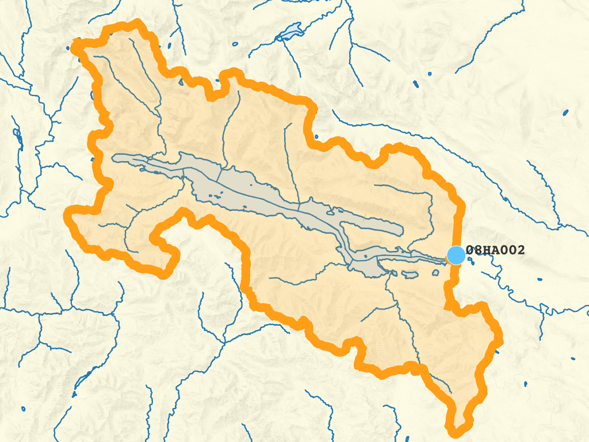
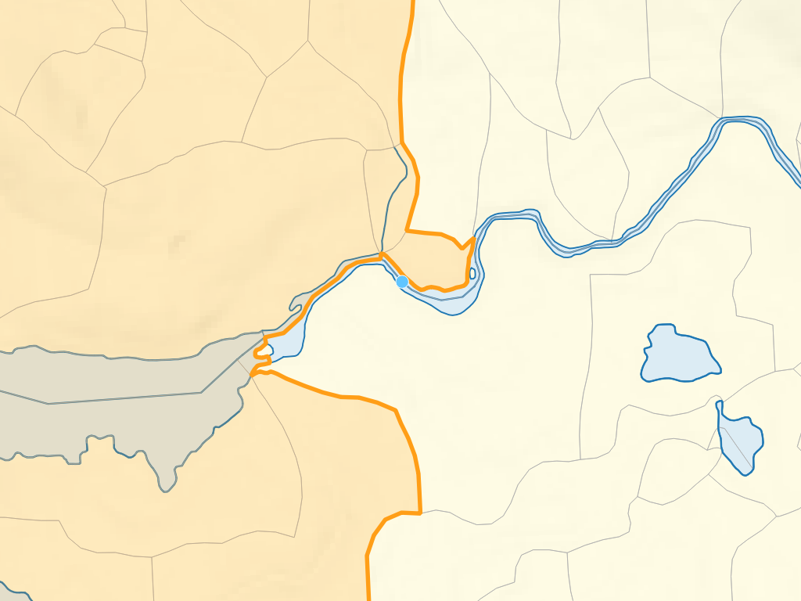
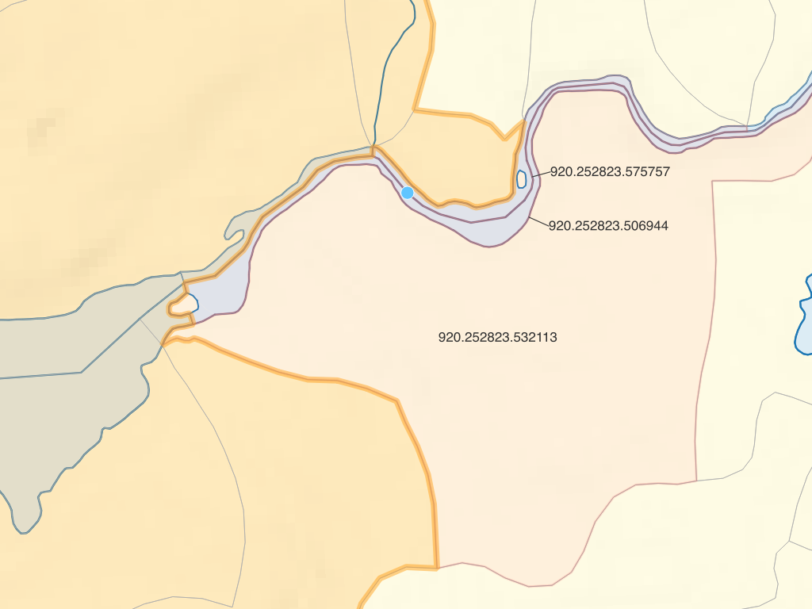
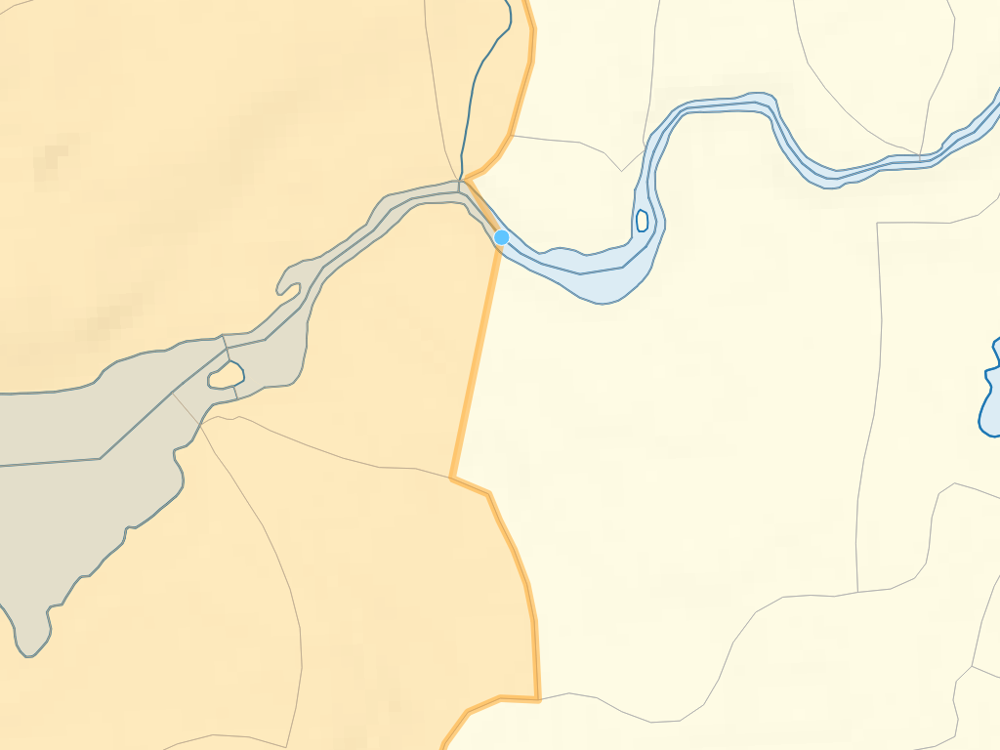

# Usage

This document presumes a working familiarity with FWA data and PostgreSQL/PostGIS.


## Upstream / downstream analysis

The most typical use of `fwapg` is to answer the question - "what is upstream or downstream of these points of interest"?  Before answering this question, we have to link the points of interest to the FWA streams.

### Reference a single point to the stream network

If you simply have a single point location as `X,Y` (plus coordinate system identifier), use the function `FWA_IndexPoint`.


For example, to find the nearest point on the FWA stream network to location `-123.7028, 48.3858`:

```sql
    SELECT *
    FROM FWA_IndexPoint(-123.7028, 48.3858, 4326);
```

This snaps the input point to the closest stream - it returns information about the closest stream, minimum distance from input point to the stream, and the geometry of the closest point on the stream to the point:

    linear_feature_id |  gnis_name  | wscode_ltree | localcode_ltree | blue_line_key | downstream_route_measure | distance_to_stream | bc_ind | geom
    -------------------+-------------+--------------+-----------------+---------------+--------------------------+--------------------+--------+
             710513719 | Sooke River | 930.023810   | 930.023810      |     354153927 |        350.2530543284006 | 24.228 | t      |

This function is available via the `fwapg` [feature service](https://www.hillcrestgeo.ca/fwapg/functions/fwa_indexpoint.html) - you can experiment with it [directly](https://www.hillcrestgeo.ca/fwapg/functions/fwa_indexpoint/items.html?x=-123.7028&y=48.3858&srid=4326) without having to install fwapg (zoom out to see the context in the default web map).


### Reference many points to stream network

Referencing a single point is handy but generally it is necessary to join/snap an entire table of point geometries to FWA streams. We can download Environment Canada hydrometric stations as an example point dataset:

```bash
  # download csv
  wget http://dd.weather.gc.ca/hydrometric/doc/hydrometric_StationList.csv

  # clean the header
  sed '1s/.*/id,name,lat,lon,prov,timezone/' hydrometric_StationList.csv > hydrostn.csv

  # Create a table of BC Albers points from the input lat/lon values
  ogr2ogr \
    -s_srs EPSG:4326 \
    -t_srs EPSG:3005 \
    -f PostgreSQL "PG:host=$PGHOST user=$PGUSER dbname=$PGDATABASE" \
    -lco GEOMETRY_NAME=geom \
    -oo X_POSSIBLE_NAMES=lon* \
    -oo Y_POSSIBLE_NAMES=lat* \
    -oo KEEP_GEOM_COLUMNS=NO \
    -sql "SELECT * FROM hydrostn WHERE prov='BC'" \
    -nln hydrostn \
    hydrostn.csv
```

Because `FWA_IndexPoint` is a table returning function, matching many points to the stream network in a single query can be done with a `LATERAL` join. Note that `FWA_IndexPoint` accepts point geometries directly, but only as BC Albers (`EPSG:3005`). For this example, just query the first five hydrometric stations.

```sql

SELECT
  pts.id,
  pts.name,
  blue_line_key,
  downstream_route_measure,
  distance_to_stream
FROM
(
  SELECT id, name, geom
  FROM hydrostn
  LIMIT 5   -- only 5 stations for this example
) pts
CROSS JOIN LATERAL
(
  SELECT *
  FROM
  FWA_IndexPoint(geom, 100, 10) -- find up to 10 streams within 100m
) i;


   id    |                name                 | blue_line_key | downstream_route_measure | distance_to_stream
---------+-------------------------------------+---------------+--------------------------+--------------------
 07EA004 | INGENIKA RIVER ABOVE SWANNELL RIVER |     359571145 |       6095.5541123470175 |             41.466
 07EA004 | INGENIKA RIVER ABOVE SWANNELL RIVER |     359233576 |                        0 |             47.233
 07EA005 | FINLAY RIVER ABOVE AKIE RIVER       |     359569942 |       42909.470879005145 |             47.372
 07EA007 | AKIE RIVER NEAR THE 760 M CONTOUR   |     359571761 |       29215.311821971634 |             41.002
 07EB002 | OSPIKA RIVER ABOVE ALEY CREEK       |     359573063 |        29005.40894424251 |              42.77
 07EC002 | OMINECA RIVER ABOVE OSILINKA RIVER  |     359571933 |       29316.915466924725 |             95.172
```


### Check results

Matching points with variable precision and accuracy to FWA streams can be a challenge. In the example above, station `07EA004` has two streams within 50m - which one is correct? Station `07EC002` is 95m from the nearest stream, is this too far to be confident about the match?

For quality matching of points to streams it is essential to be familiar with the contents and lineage of the point data. Is there any information in the data that can improve the match? How were the points collected? These hydrometric station locations were likely digitized from paper maps that used a much different scale from FWA 1:20,000 mapping - using the closest point will not work reliably. However, the data in the `name` column is consistent and appears to be very reliable - we can improve the join based on matching to the FWA stream name:


```sql
  CREATE EXTENSION IF NOT EXISTS pg_trgm;

  SELECT
    pts.id,
    pts.name,
    gnis_name,
    gnis_name % pts.name::text as trgm_comparison
  FROM
  (
    SELECT id, name, geom
    FROM hydrostn
    LIMIT 5
  ) pts
  CROSS JOIN LATERAL
  (
    SELECT *
    FROM
    FWA_IndexPoint(geom, 100, 10)
  ) i;

     id    |                name                 |   gnis_name    | trgm_comparison
---------+-------------------------------------+----------------+-----------------
 07EA004 | INGENIKA RIVER ABOVE SWANNELL RIVER | Ingenika River | t
 07EA004 | INGENIKA RIVER ABOVE SWANNELL RIVER |                |
 07EA005 | FINLAY RIVER ABOVE AKIE RIVER       | Finlay River   | t
 07EA007 | AKIE RIVER NEAR THE 760 M CONTOUR   | Akie River     | t
 07EB002 | OSPIKA RIVER ABOVE ALEY CREEK       | Ospika River   | t
 07EC002 | OMINECA RIVER ABOVE OSILINKA RIVER  | Omineca River  | t
```

If this is good enough, the query can be adjusted to return only the stream within 100m where the point stream name matches the FWA stream name (according to `pg_trgm`):

```sql
SELECT
  pts.id,
  pts.name,
  blue_line_key,
  downstream_route_measure
FROM
(
  SELECT id, name, geom
  FROM hydrostn
  LIMIT 5
) pts
CROSS JOIN LATERAL
(
  SELECT *
  FROM
  FWA_IndexPoint(geom, 100, 10)
) i
WHERE gnis_name % pts.name::text;

   id    |                name                 | blue_line_key | downstream_route_measure
---------+-------------------------------------+---------------+--------------------------
 07EA004 | INGENIKA RIVER ABOVE SWANNELL RIVER |     359571145 |       6095.5541123470175
 07EA005 | FINLAY RIVER ABOVE AKIE RIVER       |     359569942 |       42909.470879005145
 07EA007 | AKIE RIVER NEAR THE 760 M CONTOUR   |     359571761 |       29215.311821971634
 07EB002 | OSPIKA RIVER ABOVE ALEY CREEK       |     359573063 |        29005.40894424251
 07EC002 | OMINECA RIVER ABOVE OSILINKA RIVER  |     359571933 |       29316.915466924725
```

This should produce a more reliable output than matching only on the closest stream. However, simply filtering on a true/false string comparison is likely still error prone - for the first station in the list, what would happen if Swanell River was within 100m? To ensure any subsequent upstream analysis are done on the correct stream system, matches for points in this dataset will generally have to have to be manually QA'ed.

Other possible attributes for improving matches could include:

- 1:50,000 watershed code (the FWA provides a lookup between 50k and 20k watershed codes)
- channel width or similar (compare to the FWA stream order, a point at 1m width should not be matched to a 5th order FWA stream)

If no additional information is available, it may be best to filter results where there are >1 matches within 100m (or whatever tolerance works with your data) and complete the matching of these points manually.

To cut down on the code for below examples, we can create a table holding the results:

```sql
CREATE TABLE hydrostn_events AS
SELECT
  pts.id,
  pts.name,
  i.blue_line_key,
  i.downstream_route_measure,
  i.wscode_ltree,
  i.localcode_ltree,
  i.distance_to_stream,
  i.geom::geometry(Point, 3005)
FROM
(
  SELECT id, name, geom
  FROM hydrostn
) pts
CROSS JOIN LATERAL
(
  SELECT *
  FROM
  FWA_IndexPoint(geom, 100, 10)
) i
WHERE gnis_name % pts.name::text
ORDER BY pts.id;
```

### Query downstream

Once features are referenced to the stream network, determining what is upstream/downstream is done by comparing the watershed codes and `blue_line_key` / `route_measure`. Using `FWA_Downstream` enables doing this with a join:

```sql
SELECT
  e.id,
  e.name,
  SUM(st_length(s.geom)) / 1000 as length_dnstr_km
FROM (SELECT * FROM hydrostn_events LIMIT 5) as e
INNER JOIN whse_basemapping.fwa_stream_networks_sp s
ON FWA_Downstream(
  e.blue_line_key, e.downstream_route_measure, e.wscode_ltree, e.localcode_ltree,
  s.blue_line_key, s.downstream_route_measure, s.wscode_ltree, s.localcode_ltree
)
GROUP BY e.id, e.name
ORDER BY e.id;

   id    |                name                 |   length_dnstr_km
---------+-------------------------------------+--------------------
 07EA004 | INGENIKA RIVER ABOVE SWANNELL RIVER |  908.3217090864651
 07EA005 | FINLAY RIVER ABOVE AKIE RIVER       |  996.3101858316527
 07EA007 | AKIE RIVER NEAR THE 760 M CONTOUR   | 1011.4124142994692
 07EB002 | OSPIKA RIVER ABOVE ALEY CREEK       |  834.4111401643679
 07EC002 | OMINECA RIVER ABOVE OSILINKA RIVER  |  778.6774554185706
```

Note that this is only the downstream portion present in the FWA data - if the point is in the Columbia basin or similar, portions of stream not in BC are not included.

### Query upstream

An upstream query is almost the same, using `FWA_Upstream`:

```sql
SELECT
  e.id,
  e.name,
  SUM(st_length(s.geom)) / 1000 as length_upstr_km
FROM (SELECT * FROM hydrostn_events LIMIT 5) as e
INNER JOIN whse_basemapping.fwa_stream_networks_sp s
ON FWA_Upstream(
  e.blue_line_key, e.downstream_route_measure, e.wscode_ltree, e.localcode_ltree,
  s.blue_line_key, s.downstream_route_measure, s.wscode_ltree, s.localcode_ltree
)
GROUP BY e.id, e.name
ORDER BY e.id;

   id    |                name                 |   length_upstr_km
---------+-------------------------------------+--------------------
 07EA004 | INGENIKA RIVER ABOVE SWANNELL RIVER |  8355.325367888996
 07EA005 | FINLAY RIVER ABOVE AKIE RIVER       |   41388.6738526307
 07EA007 | AKIE RIVER NEAR THE 760 M CONTOUR   | 4999.9129992270255
 07EB002 | OSPIKA RIVER ABOVE ALEY CREEK       |  5907.417221603829
 07EC002 | OMINECA RIVER ABOVE OSILINKA RIVER  | 10042.880207799402
```

As with the downstream query, only features within BC are returned. The above `length_upstr_km` will be incorrect for trans-boundary watersheds.

More general upstream queries are possible as well:

- how many stations are upstream of Hope?

```sql
SELECT
  COUNT(*)
FROM hydrostn_events e
WHERE FWA_Upstream(
  356364114, 160400, '100'::ltree, '100.113848'::ltree,
  e.blue_line_key, e.downstream_route_measure, e.wscode_ltree, e.localcode_ltree
);

 count
-------
    83
```

- how much additional stream network is isolated by the Site C dam? (ie, upstream of Site C, but not upstream of the Bennet Dam)

```sql
SELECT
  SUM(ST_Length(geom)) / 1000 as length_km
FROM whse_basemapping.fwa_stream_networks_sp s
WHERE FWA_Upstream(
  359572348, 1597489, '200.948755'::ltree, '200.948755.816999'::ltree,
  s.blue_line_key, s.downstream_route_measure, s.wscode_ltree, s.localcode_ltree
) AND NOT FWA_Upstream(
  359572348, 1706733, '200.948755'::ltree, '200.948755.871814'::ltree,
  s.blue_line_key, s.downstream_route_measure, s.wscode_ltree, s.localcode_ltree
);

     length_km
--------------------
 28974.584934736216
```


### Generate watershed

With `FWA_Upstream` in hand, creating a watershed boundary now seems straightforward - find the fundamental watersheds upstream and aggregate them. For example, to extract the watershed upstream of hydrometric station `08HA002` as a single polygon, using unaltered FWA linework:

```sql
SELECT
  p.id,
  ST_Union(w.geom) AS geom
FROM hydrostn_events p
INNER JOIN whse_basemapping.fwa_watersheds_poly w
ON FWA_Upstream(
  p.wscode_ltree, p.localcode_ltree,
  w.wscode_ltree, w.localcode_ltree
)
WHERE p.id = '08HA002'
GROUP BY p.id;
```

This successfully creates the watershed boundary:



But if we look closely at the fundamental watersheds near the point, the watershed boundary is a bit different from what might be expected:



The `local_watershed_code` value for the stream at the point location is `920.252823.584332` - the three highlighted fundamental watersheds all have lower `local_watershed_code` values and are thus not returned by `FWA_Upstream`. This is typical for points found on FWA waterbodies - the fundamental watersheds making up waterbodies are defined by a complex set of rules.



To clean up this issue and others, `fwapg` provides the `FWA_WatershedAtMeasure` function. Given a point defined by `blue_line_key` and `downstream_route_measure`, the function will return a polygon defining the watershed upstream of the point following this set of rules:

1. If the point is within a lake, return everything upstream of the lake's *outflow*
2. If the point is within a polygonal river/canal the fundamental watersheds are
cut across the banks of the river/canal before being included in the aggregation
3. If the point is < 100m downstream from the top of the fundamental
watershed in which it falls, then that fundamental watershed is not included in the aggregation
4. If the point is < 50 m upstream from the bottom of the fundamental
watershed in which it falls, then that watershed is included in the aggregation

`FWA_WatershedAtMeasure` also attempts to:

- speed up the aggregation by using pre-aggregated geometries (assessment watersheds and other)
- for cross-boundary watersheds, include watershed areas not in BC using these data sources:
    + USGS [huc12 watersheds](https://www.usgs.gov/core-science-systems/ngp/national-hydrography/watershed-boundary-dataset?qt-science_support_page_related_con=4#qt-science_support_page_related_con) for USA (WA, ID, MT only)
    + [hydrosheds](https://www.hydrosheds.org) watersheds for other neighbouring jurisdictions

See `FWA_WatershedAtMeasure` for more.


For the single example point, we can generate the watershed with this query:

```sql
SELECT * FROM FWA_WatershedAtMeasure(354155148,49129.75)
```

And as `FWA_WatershedAtMeasure` is also a table returning function, when joining to the source table, use a `LATERAL` join to run the query on each point. Note that this is very resource intensive, you may want to restrict the query to just a handful of points.

```sql
SELECT
  p.id,
  w.geom
FROM hydrostn_events p
LEFT JOIN LATERAL
(
  SELECT *
  FROM FWA_WatershedAtMeasure(p.blue_line_key, p.downstream_route_measure)
) w ON true
WHERE p.id = '08HA002';
```

The output looks like this:



