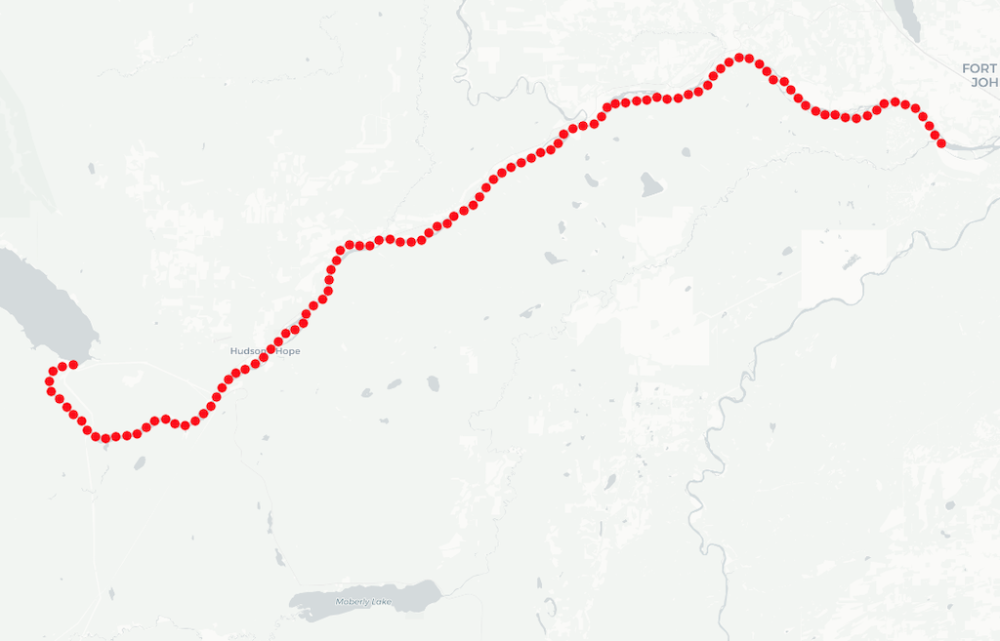
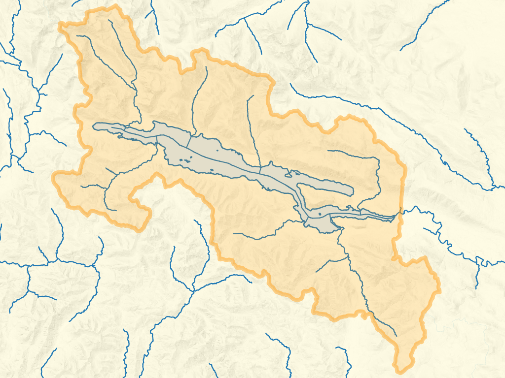
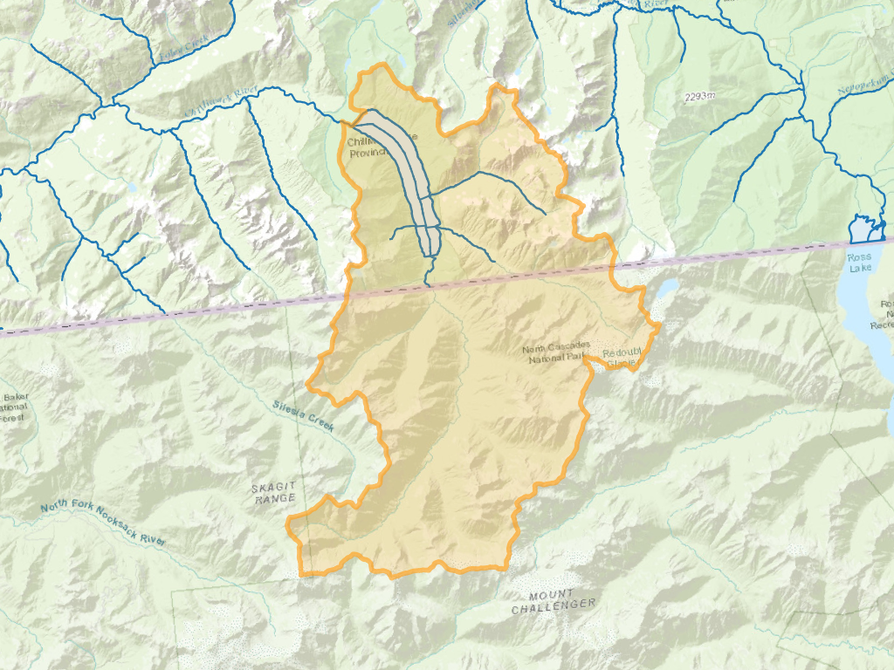

# Function reference

## FWA_Downstream

### Synopsis

```sql
FWA_Downstream(
      wscode A ltree,
      localcode A ltree,
      wscode B ltree,
      localcode B ltree
)

FWA_Downstream(
    blue_line_key A integer,
    downstream_route_measure A double precision,
    wscode_ltree A ltree,
    localcode_ltree A ltree,
    blue_line_key B integer,
    downstream_route_measure B double precision,
    wscode_ltree B ltree,
    localcode_ltree B ltree,
    include_equivalents boolean default False,
    tolerance double precision default .001
)
```

### Description

Return `True` if the watershed codes / measures B are downstream of watershed codes / measure A.

For polygonal features (where no `blue_line_key` / `downstream_route_measure` is present), use the shorter form of the function.

For point locations referenced to the stream network, use the form of the function with `blue_line_key` and `downstream_route_measure`.  Also, specify `True` for `include_equivalents` if you want to evaluate as true for features with exactly the same linear position.

### Examples

1. At its most basic, the function compares two watershed code / local code `ltree` pairs and returns `True` if the second pair is a parent of the first set (ie, downstream).

    ```sql
    SELECT FWA_Downstream(
      '100.100000.000100'::ltree,
      '100.100000.000100'::ltree,
      '100.100000'::ltree,
      '100.100000'::ltree
    )
    ```
    ```
     fwa_downstream
    ----------------
     t
    ```

2. Find features downstream of a known location on the network - this query finds the total length of stream downstream from Hope. Note that this result includes side channels, it is not necessarily the distance to the ocean:

    ```sql
    SELECT
      ROUND((SUM(st_length(s.geom)) / 1000)::numeric, 2) as length_dnstr_km
    FROM whse_basemapping.fwa_stream_networks_sp s
    WHERE FWA_Downstream(
      356364114, 160400, '100'::ltree, '100.113848'::ltree,
      s.blue_line_key, s.downstream_route_measure, s.wscode_ltree, s.localcode_ltree
    );
    ```
    ```
     length_dnstr_km
    -----------------
              308.54
    ```
    Refine this slightly to find the distance to the ocean along the Fraser mainstem (where `blue_line_key` is equal to `watershed_key`:

    ```sql
    SELECT
      ROUND((SUM(st_length(s.geom)) / 1000)::numeric, 2) as length_dnstr_km
    FROM whse_basemapping.fwa_stream_networks_sp s
    WHERE FWA_Downstream(
      356364114, 160400, '100'::ltree, '100.113848'::ltree,
      s.blue_line_key, s.downstream_route_measure, s.wscode_ltree, s.localcode_ltree
    )
    AND watershed_key = blue_line_key; -- do not include side channels
    ```
    ```
     length_dnstr_km
    -----------------
              161.40
    ```
3. For each feature in table A, find all records downstream in table B and collect them into an array. This query lists all dams downstream of each fish passage field assessment location (data from [`bcfishpass`](https://github.com/smnorris/bcfishpass))

    ```sql
    SELECT
      a.aggregated_crossings_id,
      array_agg(b.dam_id) as downstream_dam_ids
    FROM bcfishpass.crossings a
    INNER JOIN bcfishpass.dams b
    ON FWA_Downstream(
      a.blue_line_key,
      a.downstream_route_measure,
      a.wscode_ltree,
      a.localcode_ltree,
      b.blue_line_key,
      b.downstream_route_measure,
      b.wscode_ltree,
      b.localcode_ltree
    )
    WHERE a.stream_crossing_id IS NOT NULL
    GROUP BY a.aggregated_crossings_id
    ```
    ```
     aggregated_crossings_id | downstream_dam_ids
    -------------------------+-----------------------
                        4790 | {2343}
                       69233 | {917,1801,2165,2310}
                        5468 | {2472}
                      125252 | {15,97,213,1917}
                        5697 | {2472}
                         176 | {2472}
                         576 | {426}
    ```

## FWA_IndexPoint

### Synopsis

```sql
FWA_IndexPoint(
    point geometry(Point, 3005),
    tolerance float DEFAULT 5000,
    num_features integer DEFAULT 1
)

FWA_IndexPoint(
    x float,
    y float,
    srid integer,
    tolerance float DEFAULT 5000,
    num_features integer DEFAULT 1
)
```

### Description

Snaps a point to the stream network. Provided a point (as either a BC Albers point geometry or (`x, y, srid`), return a table containing the point geometry of the closest point on the FWA stream network to the given point, plus additional attributes from the matched stream:

| field                     | type                  | description                                 |
| :-------------------------| --------------------- |-------------------------------------------- |
| `linear_feature_id`       | bigint                | unique identifier of matched stream         |
| `gnis_name`               | text                  | stream name of matched stream               |
| `wscode_ltree`            | ltree                 | stream watershed code                       |
| `localcode_ltree`         | ltree                 | stream local watershed code                 |
| `blue_line_key`           | integer               | stream blue line key (route identifier)     |
| `downstream_route_measure`| double precision      | measure value of output point               |
| `distance_to_stream`      | double precision      | distance from input point to output point   |
| `bc_ind`                  | boolean               | Indicates if the source point is in BC      |
| `geom`                    | geometry(Point, 3005) | The closest point on the FWA stream network |

### Examples

1. Return the closest point on FWA stream network to a point defined by a lat/lon (within default 5000m tolerance):

    ```sql
    SELECT * FROM FWA_IndexPoint(-123.7028, 48.3858, 4326);
    ```
    ```
     linear_feature_id |  gnis_name  | wscode_ltree | localcode_ltree | blue_line_key | downstream_route_measure | distance_to_stream | bc_ind |                        geom
    -------------------+-------------+--------------+-----------------+---------------+--------------------------+--------------------+--------+----------------------------------------------------
             710513719 | Sooke River | 930.023810   | 930.023810      |     354153927 |        350.2530543284006 |             24.228 | t      | 0101000020BD0B0000D579287B42DC314198937D515C061741
    ```

2. Index a set of point geometries, finding up to 10 features within 100m:

    ```sql
    SELECT
      pts.id,
      i.*
    FROM (
      VALUES
      ('07EA004', ST_SetSRID(ST_MakePoint(1054676, 1304723), 3005)),
      ('07EA005', ST_SetSRID(ST_MakePoint(1045356, 1348750), 3005)),
      ('07EA007', ST_SetSRID(ST_MakePoint(1066334, 1356262), 3005)),
      ('07EB002', ST_SetSRID(ST_MakePoint(1126747, 1283184), 3005)),
      ('07EC002', ST_SetSRID(ST_MakePoint(1089342, 1214473), 3005))
    ) AS pts (id, geom)
    LEFT JOIN LATERAL
    (
      SELECT *
      FROM
      FWA_IndexPoint(geom, 100, 10)
    ) i on true;
    ```
    ```
       id    | linear_feature_id |   gnis_name    |       wscode_ltree       |         localcode_ltree         | blue_line_key | downstream_route_measure | distance_to_stream | bc_ind |                        geom
    ---------+-------------------+----------------+--------------------------+---------------------------------+---------------+--------------------------+--------------------+--------+----------------------------------------------------
     07EA004 |          68051401 | Ingenika River | 200.948755.992594        | 200.948755.992594.039418        |     359571145 |        6096.256539019577 |             41.319 | t      | 0101000020BD0B00007FFBC4C0C617304173BF3D23BAE83341
     07EA004 |          68051402 |                | 200.948755.992594.042767 | 200.948755.992594.042767        |     359233576 |                        0 |              46.77 | t      | 0101000020BD0B000023DBF9FEB11730413108AC1CB3E83341
     07EA005 |          49095881 | Finlay River   | 200.948755.999851        | 200.948755.999851.137838        |     359569942 |        42909.36746325051 |             47.258 | t      | 0101000020BD0B0000C3F5289C79E62F41508D976E90943441
     07EA007 |          49083226 | Akie River     | 200.948755.999851.088011 | 200.948755.999851.088011.231827 |     359571761 |        29215.40257114563 |             40.442 | t      | 0101000020BD0B000037B9E4F44B4530410DDF6ACEC1B13441
     07EB002 |         161051216 | Ospika River   | 200.948755.951156        | 200.948755.951156.201899        |     359573063 |       29005.449548147713 |             41.647 | t      | 0101000020BD0B0000D7D491C73F3131419708AD7A50943341
     07EC002 |         115033725 | Omineca River  | 200.948755.944288        | 200.948755.944288.110746        |     359571933 |        29317.40902691083 |             95.125 | t      | 0101000020BD0B000054618DD09A9F3041A0D25C29F4873241
    ```

### Web service

[FWA_IndexPoint](https://tiles.hillcrestgeo.ca/fwa/functions/fwa_indexpoint.html)


## FWA_LocateAlong

### Synopsis

```sql
FWA_LocateAlong(blue_line_key integer, downstream_route_measure float)
```

### Description

Return a table containing a single point geometry corresponding to the position on the FWA stream network of input `blue_line_key`, `downstream_route_measure`.

### Example

Create a point geometry at measure 25,000 on the Skeena River:
```sql
    SELECT ST_AsText(
        FWA_LocateAlong(
          (
            SELECT DISTINCT blue_line_key
            FROM whse_basemapping.fwa_stream_networks_sp
            WHERE gnis_name = 'Skeena River'
          ),
        25000
        )
    );
```
```
                         st_astext
-----------------------------------------------------------
 POINT ZM (754013.9457165595 1029911.1568720527 5.5 25000)

```

### Web service

[FWA_LocateAlong](https://tiles.hillcrestgeo.ca/fwa/functions/fwa_locatealong.html)


## FWA_LocateAlongInterval

### Synopsis

```sql
FWA_LocateAlongInterval(
  blue_line_key integer,
  start_measure integer DEFAULT 0,
  interval_length integer DEFAULT 1000,
  end_measure integer DEFAULT NULL
)
```

### Description

Return a table representing points along a stream between input locations at specified interval.

| field                     | type                  | description                                 |
| :-------------------------| --------------------- |-------------------------------------------- |
| `index`                   | integer               | 0 based index of returned features          |
| `downstream_route_measure`| double precision      | measure value of output point               |
| `geom`                    | geometry(Point, 3005) | Point geometry at the measure               |

### Example

Return points at a 1km interval along the Peace between Site C and Bennet dams:

```sql
  SELECT
     index as id,
     downstream_route_measure,
     ST_AsText(geom)
  FROM FWA_LocateAlongInterval(
    359572348,
    1597489,
    1000,
    1706733
    );
```
```
 id  | downstream_route_measure |                                  st_astext
-----+--------------------------+-----------------------------------------------------------------------------
   0 |                  1597489 | POINT ZM (1314468.0708699157 1256099.567354601 412.98247677532964 1597489)
   1 |                  1598489 | POINT ZM (1313779.3421101477 1256817.5566858777 413.709000000003 1598489)
   2 |                  1599489 | POINT ZM (1313217.588407995 1257612.8656611862 413.9290255060764 1599489)
   3 |                  1600489 | POINT ZM (1312633.1479665248 1258419.2668507479 414 1600489)
...
```
Mapping the returned features:



### Web service

[FWA_LocateAlongInterval](https://tiles.hillcrestgeo.ca/fwa/functions/fwa_locatealonginterval.html)

Make the same request as the example above, but
[at 10km](https://tiles.hillcrestgeo.ca/fwa/functions/fwa_locatealonginterval/items.html?blue_line_key=359572348&start_measure=1597489&interval_length=10000&end_measure=1706733&limit=100)


## FWA_Upstream

### Synopsis

```sql
-- compare watershed codes only
FWA_Upstream(
    wscode_ltree_a ltree,
    localcode_ltree_a ltree,
    wscode_ltree_b ltree,
    localcode_ltree_b ltree
)

-- compare watershed codes and route positions (lines)
FWA_Upstream(
    blue_line_key_a integer,
    downstream_route_measure_a double precision,
    upstream_route_measure_a double precision,
    wscode_ltree_a ltree,
    localcode_ltree_a ltree,
    blue_line_key_b integer,
    downstream_route_measure_b double precision,
    wscode_ltree_b ltree,
    localcode_ltree_b ltree,
    include_equivalents boolean default False,
    tolerance double precision default .001
)

-- compare watershed codes and route positions (points)
FWA_Upstream(
    blue_line_key_a integer,
    downstream_route_measure_a double precision,
    wscode_ltree_a ltree,
    localcode_ltree_a ltree,
    blue_line_key_b integer,
    downstream_route_measure_b double precision,
    wscode_ltree_b ltree,
    localcode_ltree_b ltree,
    include_equivalents boolean default False,
    tolerance double precision default .001
)
```

### Description

Return `True` if the watershed codes / measures B are upstream of watershed codes / measure A.

For polygonal features (where no `blue_line_key` / `downstream_route_measure` is present), use the shorter form of the function.

For line features, use the form of the function with `blue_line_key`, `downstream_route_measure` and `upstream_route_measure`

For point features, use the form of the function with `blue_line_key` and `downstream_route_measure`, but not `upstream_route_measure`

Specify `True` for `include_equivalents` if you want to evaluate as true for features with exactly the same linear position.


### Examples

1. At its most basic, the function compares two watershed code / local code `ltree` pairs and returns `True` if the second pair is upstream of the first pair.

    ```sql
    SELECT FWA_Upstream(
      '100.100000'::ltree,
      '100.100000'::ltree,
      '100.100000.000100'::ltree,
      '100.100000.000100'::ltree
    );
    ```
    ```
     fwa_upstream
    --------------
     t
    ```

2. Find features upstream of a known location on the network. This query finds the number of lakes upstream of the Mission/Terzaghi Dam on the Bridge River. As source FWA lakes do not have a `local_watershed_code` value, we use the `fwapg` lookup.

    ```sql
    SELECT
      count(*) AS n_lakes
    FROM whse_basemapping.fwa_lakes_poly l
    INNER JOIN whse_basemapping.fwa_waterbodies wb
    ON l.waterbody_key = wb.waterbody_key
    WHERE FWA_Upstream('100.239855','100.239855.240724', wb.wscode_ltree, wb.localcode_ltree);
    ```
    ```
     n_lakes
    ---------
         998
    (1 row)
    ```

3. For each feature in table A, find all records upstream in table B and collect them into an array. This query lists all dams upstream of each fish passage field assessment location (data from [`bcfishpass`](https://github.com/smnorris/bcfishpass))

    ```sql
    SELECT
      a.aggregated_crossings_id,
      array_agg(b.dam_id) as upstream_dam_ids
    FROM bcfishpass.crossings a
    INNER JOIN bcfishpass.dams b
    ON FWA_Upstream(
      a.blue_line_key,
      a.downstream_route_measure,
      a.wscode_ltree,
      a.localcode_ltree,
      b.blue_line_key,
      b.downstream_route_measure,
      b.wscode_ltree,
      b.localcode_ltree
    )
    WHERE a.stream_crossing_id IS NOT NULL
    GROUP BY a.aggregated_crossings_id
    ```
    ```
     aggregated_crossings_id | upstream_dam_ids
    -------------------------+-----------------------
                       69195 | {163}
                      196198 | {1427,2362}
                      195590 | {1914}
                       51959 | {2371}
                      103090 | {1085,1693,1483}
                      103088 | {1693}
                        7520 | {416,1129,708,1937,1128}
    ```

## FWA_WatershedAtMeasure

### Synopsis

```sql
FWA_WatershedAtMeasure(
    blue_line_key integer,
    downstream_route_measure float
)
```

### Description

Given a point defined by its position on the FWA stream network (`blue_line_key`,`downstream_route_measure`), return a table containing a polygon geometry that defines the point's upstream watershed.

Watershed delineation following this set of rules, in order of descending priority:

1. If the point is within a lake, return everything upstream of the lake's *outflow*
2. If the point is within a polygonal river/canal the fundamental watersheds are
cut across the banks of the river/canal before being included in the aggregation
3. If the point is < 100m downstream from the top of the fundamental
watershed in which it falls, then that fundamental watershed is not included in the aggregation
4. If the point is < 50 m upstream from the bottom of the fundamental
watershed in which it falls, then that watershed is included in the aggregation

For cross-boundary watersheds, the function returns non-BC areas using these data sources:

- USGS [huc12 watersheds](https://www.usgs.gov/core-science-systems/ngp/national-hydrography/watershed-boundary-dataset?qt-science_support_page_related_con=4#qt-science_support_page_related_con) for USA (WA, ID, MT only)
- [hydrosheds](https://www.hydrosheds.org) watersheds for other neighbouring jurisdictions

The table returned includes these columns:

| field                     | type                      | description                                 |
| :-------------------------| --------------------------|-------------------------------------------- |
| `wscode_ltree`            | `ltree`                   | watershed code of the source point          |
| `localcode_ltree`         | `ltree`                   | local watershed code of the source point    |
| `area_ha`                 | `numeric`                 | area of output geometry, hectares           |
| `refine_method`           | `text`                    | how the watershed was processed / what further processing may be required |
| `geom`                    | `geometry(Polygon, 3005)` | a polygon representing the watershed contributing to the input location |

The `refine_method` field in the output table has several possible values:

| value                     | description                                 |
| :-------------------------|-------------------------------------------- |
| `CUT`                     | Input point falls in a river/canal, output geometry is cut across the banks of the river/canal
| `DEM`                     | Input point falls on a linear stream >50m upstream from outlet of input watershed and >100m downstream from top of watershed, further processing of the fundamental watershed in which the point lies with the DEM would be valuable to improve the output watershed. This is functionally equivalent to the `DROP` value, the fundamental watershed in which the point lies is not included in the output geometry
| `DROP`                    | Input point falls on a linear stream and is <=100m downstream from the top of the fundamental watershed in which it lies - this fundamental watershed is not included in output geometry
| `KEEP`                    | Input point falls on a linear stream and is <=50m upstream from the outlet of the fundamental watershed in which it lies - this fundamental watershed is entirely retained in the output geometry
| `LAKE`                    | Input point falls within a lake/reservoir - watershed returned includes everything upstream of the outlet of the lake/reservoir


### Examples

1. Extract the geometry of the watershed upstream of the Cowichan River at Hwy 19:

    ```sql
    SELECT geom FROM FWA_WatershedAtMeasure(354155148, 49129.75);
    ```

    

2. Extract the watershed upstream of Chilliwack Lake:

    ```sql
    WITH indexed_pt AS
    (
      SELECT
        i.*
      FROM
      (
        -- find a point in the lake
        SELECT st_pointonsurface(geom) AS geom
        FROM whse_basemapping.fwa_lakes_poly
        WHERE gnis_name_1 = 'Chilliwack Lake'
      ) AS pt
      LEFT JOIN LATERAL
      (
        SELECT *
        FROM
        FWA_IndexPoint(geom, 100) -- index the point in the lake to the nearest FWA stream
      ) i on true
    )

    SELECT *
    FROM FWA_WatershedAtMeasure(
      (SELECT blue_line_key from indexed_pt),
      (SELECT downstream_route_measure from indexed_pt)
    );
    ```

    ```
       wscode_ltree    |     localcode_ltree      | area_ha  | refine_method  | geom
    -------------------+--------------------------+----------+----------------+-----
     100.064535.057628 | 100.064535.057628.634957 | 33478.28 | LAKE           |
    ```

    Mapped, the geometry looks like this - FWA heights of land in BC, HUC12 heights of land in the USA:

    

### Web service

[FWA_WatershedAtMeasure](https://tiles.hillcrestgeo.ca/fwa/functions/fwa_watershedatmeasure.html)